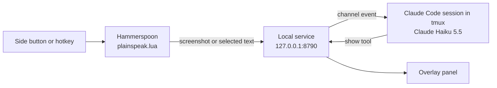
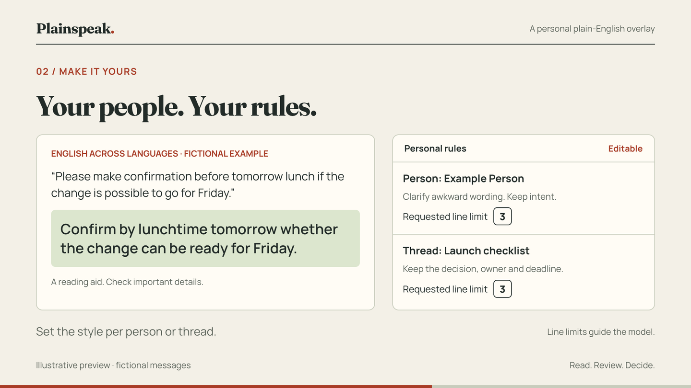

# Plainspeak

A plain-English overlay for macOS. Press a mouse side button on a message that
takes too much work to read, and a small panel tells you what it means. Press the
other button and it fixes the wording. Nothing is ever sent for you.


It helps with AI filler, awkward wording across languages, and spelling, swapped
letters or missing words. It runs on **Claude Haiku 5.5** through your Claude Code
subscription login. No API keys. macOS only.

## Why use it

Some messages take more work to read than they should. Plainspeak does that work
on the screen you already have open.

- **Get the point fast.** Long, padded or AI-written messages come back as the
  point, what they want from you, the deadline and anything unclear.
- **Read across languages.** Awkward wording from someone writing in a second
  language is read for what they meant.
- **Easier to read.** Short parts, bold labels and clear gaps between them,
  following the British Dyslexia Association's style guide.
- **Check your own writing.** Your drafts come back with spelling, swapped letters
  and missing words fixed, in your own voice.
- **You stay in control.** It reads only when you press a button. It never sends,
  replies or edits anything for you.

## What it does

**Read.** Point at a message and press the back side button. It captures the
focused window and explains the message under the pointer: the point, what they
want from you, any deadline, and what is unclear. Each part gets its own short
paragraph. The panel opens beside the pointer. Real output from Haiku 5.5:


**Correct.** The front side button fixes spelling, grammar and word order in the
visible message without summarising it:


**Your own drafts.** Select text you wrote and press Control + Option + Command + D.
You get a correction to review, paste and send yourself:


**Context.** Command + back side button also searches your Obsidian notes and
Google Drive, and cites what it used.

## Controls

| Input | Action |
| --- | --- |
| Front side button | Read the visible message and correct its spelling and grammar |
| Back side button | Read and simplify the visible message |
| Command + back side button | Simplify, with context from your notes and Google Drive |
| Control + Option + Command + R | Same as the back side button |
| Control + Option + Command + D | Correct the text you have selected (your own draft) |
| Control + Option + Command + G | Same as Command + back side button |
| Escape, or click anywhere else once the result shows | Close the overlay |

A **PS** item in the menu bar offers the same actions, plus **Set front mouse
button…** and **Set back mouse button…** for mice that number their buttons
differently. The assigned side buttons stop working as browser Back and Forward.
With any other modifier held they behave normally.

## How it works



1. Hammerspoon captures the focused window, or your selected text for drafts.
2. It posts the capture to a small Bun service on `127.0.0.1`, authenticated
   with a local token.
3. The service passes it to a long-running Claude Code session as a channel event.
   That session runs inside tmux, so no terminal window has to stay open.
4. Claude reads the capture and returns plain text through the `show` tool.
5. The overlay panel polls the service and displays the result.

The session can only show text in the overlay and read your notes. Shell
commands, file edits and known messaging tools are denied in
`daemon/claude-settings.json`.

## What you need

Install these before you start. The commands use [Homebrew](https://brew.sh/).

| What | Why Plainspeak needs it | How to install |
| --- | --- | --- |
| macOS 13 or later | Claude Code needs it | - |
| Xcode Command Line Tools | `git` to clone the repo, `python3` for the installer | `xcode-select --install` |
| [Hammerspoon](https://www.hammerspoon.org/) | Watches the buttons and hotkeys, takes the screenshot, shows the panel | `brew install --cask hammerspoon` |
| [Bun](https://bun.sh/) | Runs the small local service | `brew install oven-sh/bun/bun` |
| [tmux](https://github.com/tmux/tmux) | Keeps the Claude session running in the background | `brew install tmux` |
| [Claude Code](https://code.claude.com/docs/en/setup) | Runs Claude Haiku 5.5 on your plan | `brew install --cask claude-code` |
| A Claude Pro, Max, Team or Enterprise plan | Plainspeak uses your plan, not an API key. The free plan has no Claude Code | Run `claude` once and sign in |
| A mouse with side buttons (optional) | The quickest way to use it. Hotkeys work without one | - |

Hammerspoon also needs two macOS permissions, **Accessibility** and **Screen
Recording**. Step 3 of the setup covers them.

Claude Code channels are a research preview. Team and Enterprise organisations
must enable them. See [Claude channels](https://code.claude.com/docs/en/channels).

## Set up

**1. Clone and install.** Use a clone you will keep. Hammerspoon loads its script
from this folder.

```sh
git clone https://github.com/OscarC178/Plain-speak.git
cd Plain-speak
bun install
```

**2. Create your personal rules** (optional, the example works as it is):

```sh
mkdir -p ~/.plainspeak
cp rules/rules.example.yaml ~/.plainspeak/rules.yaml
bun run rules:check
```

**3. Install the Hammerspoon module.** This links `plainspeak.lua` into
`~/.hammerspoon` and adds `require("plainspeak")` to your `init.lua`. It refuses
to overwrite an existing, unrelated `plainspeak.lua`.

```sh
bun run install:hammerspoon
```

Open Hammerspoon and grant it **Accessibility** and **Screen Recording** in
System Settings > Privacy & Security. Then quit and reopen Hammerspoon. Reload
Config is not enough: it reloads the Lua but the running process keeps its old
permissions.

**4. Start the session and accept its first-run prompts.**

```sh
bun run daemon:start
bun run daemon:attach
```

In the attached terminal, accept **Yes, I trust this folder** if asked, then
**I am using this for local development** for the channel warning. Detach with
Control + B, then D. The PS item should now appear in the menu bar.

**5. Check it.**

```sh
bun run daemon:status
```

You should see `"transport":"connected"`. Focus a message and press a side button.

## Run it

There are three ways to keep the session running. They share one tmux session
called `plainspeak`, so only one runs at a time.

**From a terminal.**

```sh
bun run daemon:start    # start the session in tmux
bun run daemon:attach   # see it, answer prompts, check quota (Control + B, D to leave)
bun run daemon:status   # is it up?
bun run daemon:stop     # stop it
```

**From Slipway.** Nothing to configure. Add the repo, open any branch or
worktree, and press **Start dev server** in the Run panel. With no Dev Start
Command saved, Slipway runs `npm run dev`, and this repo's `dev` script starts
Plainspeak. If you have saved commands for this repo, add `npm run dev` to them
or clear the list.

`npm run dev` (or `bun run dev`) runs `daemon/slipway-run.sh`. Slipway's Run
panel has no terminal, so the script starts the tmux session, accepts the channel
warning for you, and prints a health line every minute. Stopping the tab stops
the session. If the session dies, the tab ends with an error.

Because the command lives in the repo, every branch and worktree runs its own
copy of the script. Only start branches you trust: the script runs with your
user rights. A fresh worktree installs its dependencies on first run.
The first time Claude sees a new worktree folder it asks whether to trust it. The
script never answers that for you: it waits and tells you to run
`bun run daemon:attach` in a terminal tab and choose **Yes, I trust this folder**.

**At login.**

```sh
bun run install:launchd     # start the session when you log in
bun run uninstall:launchd
```

launchd starts the session once. It does not restart it if Claude exits, and a
fresh start still waits at the channel warning until you attach and accept it.

## How to use it

### Read a message

1. Open the message in any app: Slack, Gmail, Teams or a web page.
2. Put the pointer on the message you mean. Plainspeak explains that one and uses
   the rest of the screen only as background.
3. Press the **back** side button, or Control + Option + Command + R.
4. A panel opens beside the pointer with up to four short parts: **The point**,
   **They want**, **By** and **Unclear**. Parts that do not apply are left out.
5. Click anywhere else, or press Escape, to close it. **Copy** keeps the text.

### Fix the wording of someone else's message

Point at it and press the **front** side button. You get the same message with
spelling, grammar and word order fixed. Nothing is summarised.

### Check your own draft before you send it

1. Write your message as normal.
2. Select the text.
3. Press Control + Option + Command + D.
4. The corrected version appears in the panel and is copied to your clipboard.
5. Paste it over your draft, read it once, and send it yourself.

### Bring in background from your notes

Hold Command and press the back side button. Plainspeak also searches your
Obsidian notes and Google Drive, and lists what it used. Use it for messages that
assume you remember earlier work.

### Which one to use

| You want to | Use |
| --- | --- |
| Understand a long, vague or AI-written message | Back side button |
| Read a message full of typos | Front side button |
| Tidy your own reply before sending | Select it, then Control + Option + Command + D |
| Understand a message that refers to earlier work | Command + back side button |

### Good habits

- Treat the panel as a reading aid, not the record. Check dates, numbers and
  commitments in the original before you act.
- When a part says **Unclear**, ask the sender rather than guess.
- Point before you press. With several messages on screen, the pointer is how
  Plainspeak knows which one you mean.
- Do not capture anything you could not share with Anthropic. The screenshot goes
  to Claude through your account.
- Restart the session now and then (see [Run it](#run-it)). A long session is
  slower and uses more of your plan.

## Configure

### Model and effort

The session runs `claude-haiku-5-5` at `medium` effort by default. Override
either when starting:

```sh
PLAINSPEAK_MODEL=claude-opus-5-5 PLAINSPEAK_EFFORT=high bun run daemon:start
```

Stop the session first; a running session keeps its model.

### Personal files

Everything personal lives in `~/.plainspeak`, outside the repo, so every clone,
branch and worktree shares it. Set `PLAINSPEAK_HOME` to use another folder.

| File | Purpose |
| --- | --- |
| `token` | Shared secret between Hammerspoon and the service. Created on first start. |
| `config.json` | Optional. `{"vault": "/absolute/path/to/your/vault"}` enables notes search. |
| `rules.yaml` | Optional. Your rules. Falls back to `rules/rules.example.yaml`. |
| `*.png` | Temporary screenshots, deleted after each result or timeout. |
| `launchd.log` | Output from the login item, if installed. |

Mouse button IDs are stored in `~/.hammerspoon/plainspeak-mouse.json`.

### Rules

Rules adapt the output per app, channel, person or thread. Changes are read on
the next capture.


 Invalid YAML, unknown profiles or bad line limits fail visibly.
The example includes `ai-drivel`, `esl` and `dyslexic` profiles. Assign a profile
only when you know it fits; Plainspeak does not diagnose anyone.

```yaml
rules:
  - name: Short replies for this channel
    match: { app: slack, channel: planning }
    max_lines: 3
    instructions: Keep the decision, owner and deadline.

  - name: A particular person's messages
    match: { app: slack, person: "Example Person" }
    profile: esl
    max_lines: 5

  - name: This recurring thread
    match: { app: slack, thread: "Website release checklist" }
    instructions: Keep unresolved blockers and distinguish suggestions from decisions.
```

`app`, `channel`, `title` (regex), `text` (regex) and `mode` are matched locally.
`person`, `sender_domain` and `thread` are matched by Claude from the screenshot.
These are best-effort visual matches; if the identity is unclear, the rule is
skipped. Rules run in file order and later line limits win. `max_lines` is an
instruction to the model, not a hard limit. Allowed limits are 1 to 30.

### Notes and Google Drive context

Plainspeak ships read-only `vault_search` and `vault_note` tools for a local
Obsidian vault. Point `~/.plainspeak/config.json` at your vault and restart the
session. Search covers up to 4,000 notes and the first 16,000 characters of each.
Reads outside the vault, including through symlinks, are refused. There is no
write tool.

Google Drive works through whatever Drive connector your Claude Code account
already has. Remote tools keep their normal permission prompts, so approve read
access in the attached session. Without a connected source, the overlay says
context was not checked.

## Troubleshooting

| Symptom | Likely cause and fix |
| --- | --- |
| Buttons do nothing, or "Plainspeak unavailable" | The session is not running. Run `bun run daemon:status`, then `daemon:start`. |
| "Claude did not respond within two minutes" | The session is waiting on a prompt or a usage limit. Run `bun run daemon:attach` to see it. |
| "Unauthorised" | Hammerspoon is reading an old token. Run `bun run install:hammerspoon` again. |
| "Accessibility" or "Screen Recording is not active" | Grant the permission, then quit and reopen Hammerspoon. |
| Buttons swapped or not detected | PS menu > **Set front mouse button…**, press it, then the same for the back button. |
| Draft hotkey says to select text | The app does not expose its selection to macOS. Copy the text into another editor. |
| Slipway tab waits at "trust this folder" | First run in that worktree. Attach and choose **Yes, I trust this folder**. |

## Privacy and safety

- Screenshots and selected text go to Claude through your signed-in account. Do
  not capture anything you cannot share with the provider.
- The service binds to `127.0.0.1` and checks the token, Host and Origin headers,
  so web pages cannot post captures.
- Captures are never written to logs. Temporary screenshots are deleted after a
  result, a timeout or a clean shutdown; a crash can leave one in `~/.plainspeak`.
- Results stay in memory for ten minutes. Claude's own session history may keep
  content.
- There is no Slack or Gmail sending endpoint, and messaging tools are denied.
- Nothing runs in the background: no polling, no unread-message scraping, no
  automatic screenshots.
- A rewrite can misread a message. Check dates, numbers and commitments before
  you act on them.

## Limits

- macOS only, Claude only.
- Usage counts against your subscription. Screenshots, a growing session context
  and notes lookups all add up. Restart the session when it gets long.
- Identity-based rules depend on what Claude can see in the screenshot.
- Automatic thread lookup from a tab title is not implemented.

## Develop

```sh
bun test
bun run typecheck
```

The tests cover rule matching, capture authentication, foreign-origin rejection,
request and result correlation, concurrent captures, screenshot lifetime,
transport failure, invalid configuration and vault path boundaries. They do not
spend model usage.

References: [Claude channels](https://code.claude.com/docs/en/channels),
[channels reference](https://code.claude.com/docs/en/channels-reference),
[Hammerspoon window snapshot](https://www.hammerspoon.org/docs/hs.window.html#snapshot),
[Hammerspoon webview](https://www.hammerspoon.org/docs/hs.webview.html).

## Licence

[MIT](LICENSE). Illustrations in `docs/images` use fictional messages.
