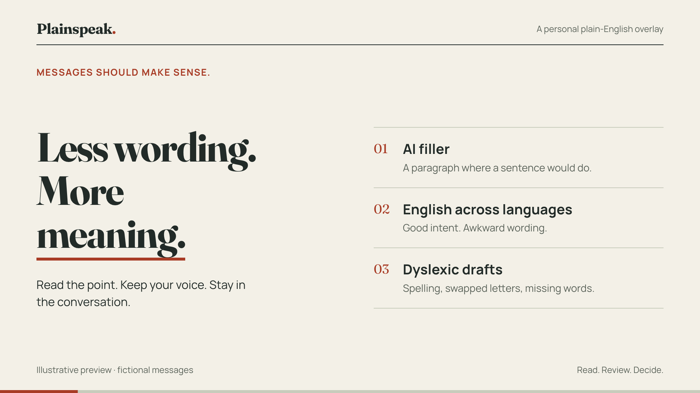
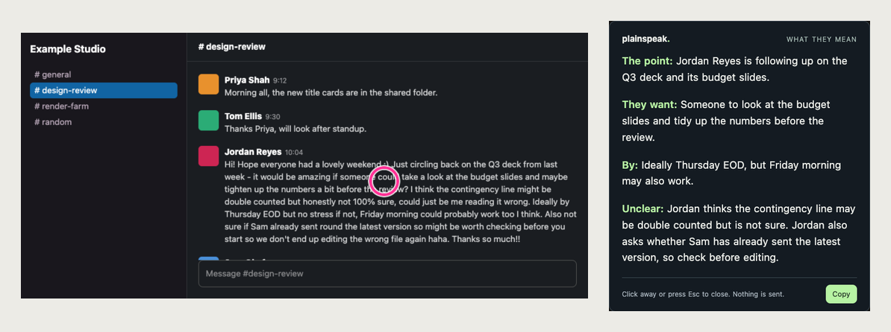
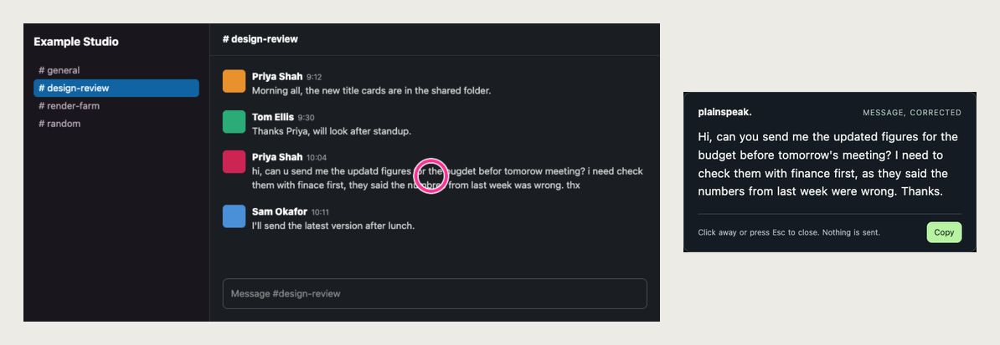
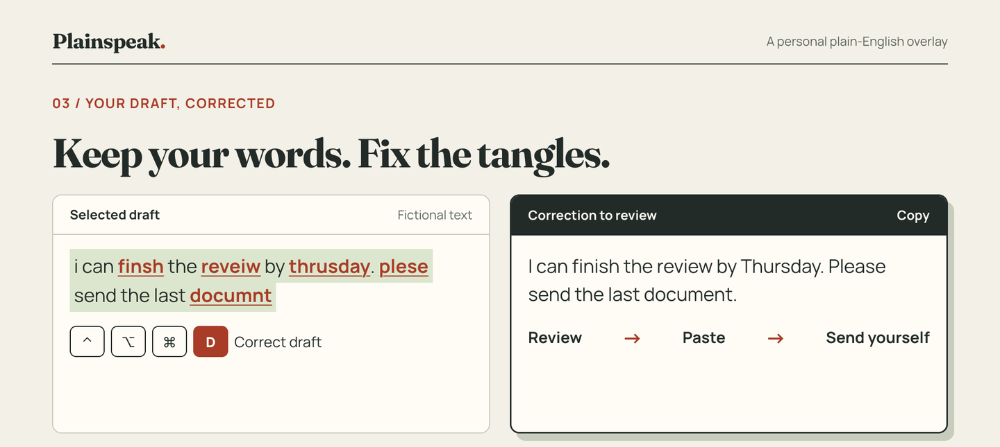
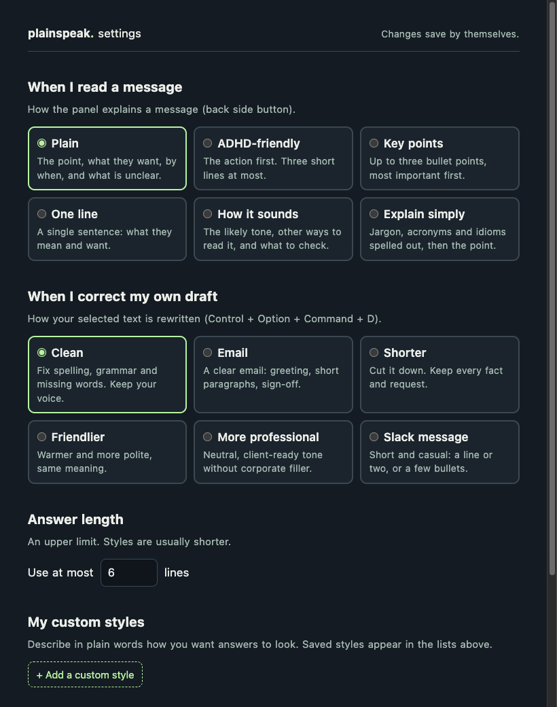
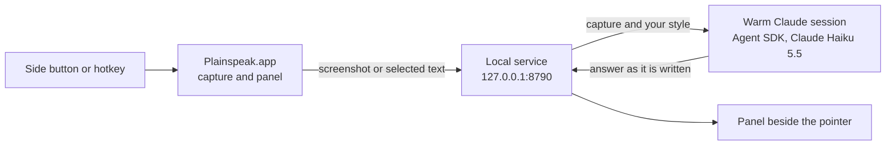

# Plainspeak

A plain-English reader for macOS. Point at a message that takes too much work to
read, press a mouse side button, and a small panel tells you what it means. Press
the other button and it fixes the wording. Nothing is ever sent for you.



Plainspeak is a menu bar app. It runs on **Claude Haiku 5.5** through your own
Claude plan, signed in with Claude Code. No API keys. macOS only.

## Why use it

Some messages take more work to read than they should. Plainspeak does that work
on the screen you already have open.

- **Get the point fast.** Long, padded or AI-written messages come back as the
  point, what they want from you, the deadline and anything unclear.
- **Read across languages.** Awkward wording from someone writing in a second
  language is read for what they meant.
- **Easier to read.** Short parts, bold labels and clear gaps between them, using
  the spacing, font and layout advice in the British Dyslexia Association's
  [style guide](https://cdn.bdadyslexia.org.uk/uploads/documents/Advice/style-guide/BDA-Style-Guide-2023.pdf?v=1680514568).
- **Your style.** ADHD-friendly, key points, one line, or a style you write
  yourself. Different styles for different apps, channels or people.
- **Check your own writing.** Your drafts come back with spelling, swapped letters
  and missing words fixed, in your own voice, or reshaped as an email or a short
  Slack message.
- **You stay in control.** It reads only when you press. It never sends, replies
  or edits anything for you.

## What it does

**Read.** Point at a message and press the back side button. A pink ring marks
where you pointed on the screenshot Claude receives, so Claude explains that
message and uses the rest of the screen only as background. The answer appears
beside the pointer, word by word, usually within two seconds.



**Correct.** The front side button fixes spelling, grammar and word order in the
message you point at, without summarising it.



**Your own drafts.** Select text you wrote and press Control + Option + Command + D.
You get a correction, already copied, to review, paste and send yourself.



**Notes and Drive.** Command + back side button also searches your Obsidian notes
and Google Drive, and says what it used.

## Controls

| Input | Action |
| --- | --- |
| Back side button | Read the message you are pointing at |
| Front side button | Correct the spelling and grammar of the message you are pointing at |
| Command + back side button | Read, with context from your notes and Google Drive |
| Control + Option + Command + R | Same as the back side button |
| Control + Option + Command + D | Correct the text you have selected (your own draft) |
| Control + Option + Command + G | Same as Command + back side button |
| Escape, or click anywhere else once the answer shows | Close the panel |

The **p.** item in the menu bar has the same actions, plus **Reading style**,
**Draft style**, **Settings…**, **Setup and permissions…** and
**Set front / back mouse button…** for mice that number their buttons differently.
The assigned side buttons stop working as browser Back and Forward; with Option,
Control, Shift or Fn held they behave normally.

## What you need

| What | Why Plainspeak needs it | How to install |
| --- | --- | --- |
| macOS 14 or later | The screen capture Plainspeak uses | - |
| Xcode Command Line Tools | `git` to clone the repo, `swift` to build the app | `xcode-select --install` |
| [Bun](https://bun.sh/) | Builds the app's local service | `brew install oven-sh/bun/bun` |
| [Claude Code](https://code.claude.com/docs/en/setup) | Signs you in to your Claude plan. Plainspeak runs Claude through that login | `brew install --cask claude-code` |
| A Claude Pro, Max, Team or Enterprise plan | Plainspeak uses your plan, not an API key. The free plan has no Claude Code | Run `claude` once and sign in |
| A mouse with side buttons (optional) | The quickest way to use it. Hotkeys work without one | - |

The `brew` commands need [Homebrew](https://brew.sh/).

## Install

**1. Build and install the app.** Use a clone you will keep.

```sh
git clone https://github.com/OscarC178/Plain-speak.git
cd Plain-speak
bun install
bun run app
```

This builds `Plainspeak.app`, puts it in `/Applications` and opens it. The
**p.** icon appears in the menu bar.

**2. Follow the setup window.** It opens by itself and ticks each item as it is done:

- **Accessibility:** press **Turn on**, then switch Plainspeak on in System Settings.
- **Screen Recording:** press **Turn on**, switch Plainspeak on, then press
  **Reopen Plainspeak**. macOS only applies this permission after a reopen.
- **Claude:** ticks itself when you are signed in to Claude Code.

**Start Plainspeak when I log in** is on. Switch it off there if you prefer.
Press **Done**. The window comes back by itself only if something stops working.

**Coming from the Hammerspoon version?** Remove `require("plainspeak")` from
`~/.hammerspoon/init.lua` and reload Hammerspoon. Your mouse button choices carry over.

## How to use it

### Read a message

1. Open the message in any app: Slack, Gmail, Teams or a web page.
2. Put the pointer on the message you mean.
3. Press the **back** side button, or Control + Option + Command + R.
4. The answer appears beside the pointer in your reading style. The default,
   **Plain**, gives up to four short parts: **The point**, **They want**, **By**
   and **Unclear**. Parts that do not apply are left out.
5. Click anywhere else, or press Escape, to close it. **Copy** keeps the text.

### Fix the wording of someone else's message

Point at it and press the **front** side button. You get the same message with
spelling, grammar and word order fixed. Nothing is summarised.

### Check your own draft before you send it

1. Write your message as normal and select it.
2. Press Control + Option + Command + D.
3. The rewritten version appears in the panel and is copied to your clipboard.
4. Paste it over your draft, read it once, and send it yourself.

### Bring in background from your notes

Hold Command and press the back side button. Plainspeak also searches your
Obsidian notes and Google Drive, and lists what it used. This takes longer,
around ten seconds, because it really searches.

### Which one to use

| You want to | Use |
| --- | --- |
| Understand a long, vague or AI-written message | Back side button |
| Read a message full of typos | Front side button |
| Tidy your own reply before sending | Select it, then Control + Option + Command + D |
| Understand a message that refers to earlier work | Command + back side button |

### Good habits

- Treat the panel as a reading aid, not the record. Check dates, numbers and
  commitments in the original before you act.
- When a part says **Unclear**, ask the sender rather than guess.
- Point at the message's text before you press, not the gap between messages.
- Do not capture anything you could not share with Anthropic. The screenshot goes
  to Claude through your account.

## Styles and rules



Open **Settings…** from the **p.** menu. Every change saves itself and applies from
your next capture. There is no Save button and nothing to restart. For a quick
switch, use **Reading style** or **Draft style** in the menu.

| Reading a message | Your drafts |
| --- | --- |
| **Plain:** the point, what they want, by when, what is unclear | **Clean:** fix spelling and grammar, keep your voice |
| **ADHD-friendly:** the action first, three short lines at most | **Email:** greeting, short paragraphs, sign-off |
| **Key points:** up to three bullets | **Shorter:** cut it down, keep every fact |
| **One line:** a single sentence | **Friendlier:** warmer, same meaning |
| **How it sounds:** the likely tone and other readings | **More professional:** client-ready, no filler |
| **Explain simply:** jargon and idioms spelled out | **Slack message:** short and casual |

**Custom styles.** Describe in plain words how you want answers to look, for
example "Lead with what I need to do. Use short bullet points." Saved styles join
the lists above and the menu.

**Rules** use a different style for one place or person:

- **When:** an app, a Slack channel or email subject, or text in the window title.
  Plainspeak checks these itself.
- **From:** a person's name, an email domain, or a described thread. Claude checks
  these from the screenshot, so they are best effort; if it cannot tell, the rule
  is skipped.
- **Then:** a reading or draft style, something about the sender (AI-written,
  writes in a second language, or a dyslexic writer), a line limit, extra
  instructions, and background for Claude.

Set a sender type only when you know it fits. Plainspeak never diagnoses anyone.

## Notes and Google Drive

For Obsidian, point `~/.plainspeak/config.json` at your vault, then quit and reopen
Plainspeak:

```json
{ "vault": "/absolute/path/to/your/vault" }
```

Search covers up to 4,000 notes and the first 16,000 characters of each. Reads
outside the vault, including through symlinks, are refused.

Google Drive works through the Drive connector your Claude account already has.
A context lookup can only run read-only Obsidian and Drive tools: sending,
sharing, writing and shell commands are blocked, even if your own Claude settings
allow them. Without a connected source, the panel says context was not checked.

## How it works



1. The app captures the focused window with Apple's ScreenCaptureKit, at full
   Retina sharpness, and draws a ring where you pointed. For drafts it takes your
   selected text instead.
2. It posts the capture to a small service inside the app, on `127.0.0.1`,
   authenticated with a local token.
3. The service adds your style and rules, and hands the capture to a Claude
   session it keeps warm through the Claude Agent SDK, signed in with your plan.
4. Claude's answer streams back and the panel shows the words as they arrive.
5. Every 15 captures the session is replaced in the background, to keep it small.

Normal reads run with no tools at all. A context lookup gets its own short session
that can only read your notes and Drive.

## Your files

Everything personal lives in `~/.plainspeak`, outside the repo. Set
`PLAINSPEAK_HOME` to use another folder.

| File | Purpose |
| --- | --- |
| `settings.json` | Your styles and rules, written by the settings window. |
| `config.json` | Optional. `{"vault": "..."}` turns on notes search. |
| `token` | Shared secret between the app and its service. Created on first start. |
| `mouse.json` | Your side button numbers. |
| `app.log` | Start-up, timings and errors. Never message content. |

## Troubleshooting

| Symptom | Likely cause and fix |
| --- | --- |
| The **p.** icon is dimmed | Plainspeak is not ready. Open the menu: the top line says why. |
| Buttons do nothing | Accessibility is off. **Setup and permissions…** in the menu. |
| "Could not capture the window" | Screen Recording is off, or on but not yet applied. Turn it on, then **Reopen Plainspeak** in the setup window. |
| "Not signed in" in the setup window | Run `claude` in a terminal, sign in, then press **Check again**. |
| "Port 8790 is in use" | Another copy of Plainspeak is running. Quit it from its menu. |
| "Claude did not respond within two minutes" | Usually a usage limit. **Open log** in the menu shows the detail. |
| Buttons swapped or not detected | **Set front mouse button…**, press it, then the same for the back button. |
| Draft hotkey says to select text | The app does not share its selection with macOS. Copy the text into another editor. |
| The wrong message was explained | Point at the message's text rather than the gap between messages. |

## Privacy and safety

- Screenshots and selected text go to Claude through your signed-in account. Do
  not capture anything you cannot share with Anthropic.
- Screenshots are never written to disk. Claude sessions are not saved to disk.
  Answers stay in memory for ten minutes.
- The service listens only on `127.0.0.1` and checks a token and the Host and
  Origin headers, so web pages cannot post captures or read answers.
- There is no sending endpoint. Normal reads run with no tools; context lookups
  can only read Obsidian and Google Drive.
- Nothing is captured in the background: no polling, no unread-message scraping,
  no automatic screenshots. Plainspeak only looks when you press.
- A rewrite can misread a message. Check dates, numbers and commitments before
  you act on them.

## Limits

- macOS only, Claude only.
- Usage counts against your plan's limits. Context lookups use more.
- Rules about people and threads depend on what Claude can see in the screenshot.
- The panel is dark only. The BDA guide prefers dark text on an off-white
  background, which is not offered yet.
- The app is signed for your own machine, not notarised, so a built copy shared
  with someone else shows macOS security warnings. They should build it themselves.

## Develop

```sh
bun test            # service, styles, settings, engine and prompt tests; no model usage
bun run typecheck
bun run app         # build, install and open Plainspeak.app
npm run dev         # the same, then follow the log; Slipway's Start dev server runs this
```

`scripts/build-app.sh` signs the app with your first code-signing identity, or
`PLAINSPEAK_SIGN_IDENTITY`, so macOS keeps its permissions across rebuilds. With no
identity it signs ad hoc and macOS asks for permissions again after each build.
`npm run dev` installs the branch you run over `/Applications/Plainspeak.app`, so
only run branches you trust.

To change the model or effort for one run, quit Plainspeak, then:

```sh
open --env PLAINSPEAK_MODEL=claude-sonnet-5-5 --env PLAINSPEAK_EFFORT=medium /Applications/Plainspeak.app
```

The icon lives in `assets/icon.svg`. Regenerate the PNG and app icon with
`scripts/make-icon.sh`, which needs `brew install librsvg`.

References: [Claude Agent SDK](https://code.claude.com/docs/en/agent-sdk/overview),
[ScreenCaptureKit](https://developer.apple.com/documentation/screencapturekit),
[BDA Dyslexia Style Guide 2023](https://cdn.bdadyslexia.org.uk/uploads/documents/Advice/style-guide/BDA-Style-Guide-2023.pdf?v=1680514568).

## Licence

[MIT](LICENSE). Images in `docs/images` use fictional messages.
